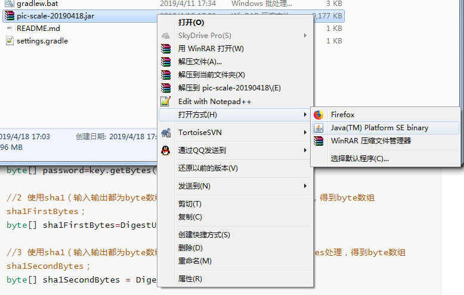

# 图片缩放GUI小工具

* 实现如下算法

  - 设当前图片大小为currentSize,目标大小为targetSize（即30）
  - 则每次先计算

  $$
  s=\sqrt{\frac{targetSize}{currentSize}}
  $$
  - 然后得到缩放的百分比b为

  $$
  b=\begin{cases} 
  s    ,s<0.9\\
  0.9  ,s\geq0.9\\
  \end{cases}
  $$
  - 直到currentSize小于等于targetSize。

* 运行和开发环境 

  - Java 8+
  - springboot+gradle

  

* jar包打开方式

右键-打开方式-选择Java如下

